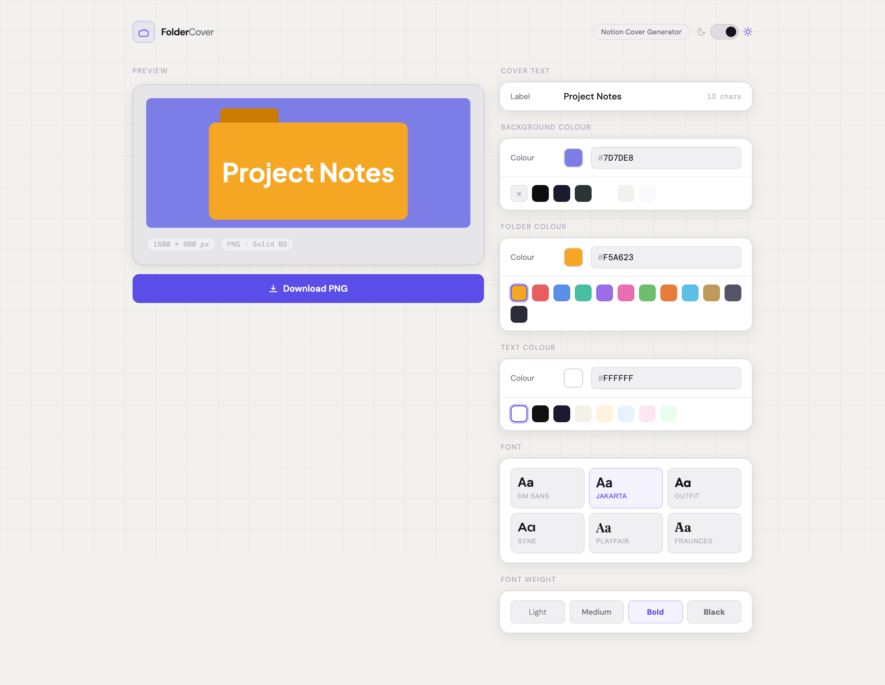
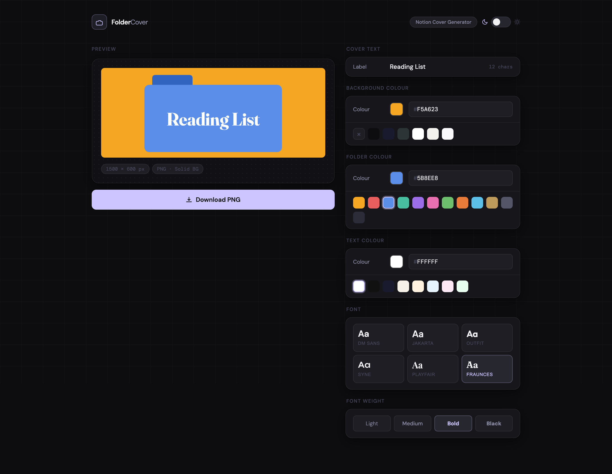

# 📂 FolderCover

I originally built this tool for myself to create custom folder-style covers for my university course pages in Notion. I wanted a way to quickly generate consistent, aesthetic tiles while having the flexibility to change the folder color, background, text, and fonts for each specific subject. I thought it might be fun and useful for others looking to organize their digital workspace with the same level of detail!

---

## 「 ✦ Preview ✦ 」

| Light Mode Interface | Dark Mode Interface |
| :---: | :---: |
|  |  |

| Sample Notion Cover |
| :---: |
|  |

---

## ⋆˙⟡ Features

* **Complete Customization:** Change the folder color, background color, and text color to match your workspace aesthetic.
* **Typography Options:** Choose from various fonts and weights to give each course a unique look.
* **Real-time Preview:** Uses a 1500x600px canvas to render high-resolution covers instantly as you edit.
* **Adaptive Theming:** The editor features native Dark and Light mode support for a comfortable design experience.
* **Optimized Export:** Downloads custom covers as PNG files perfectly sized for Notion's cover dimensions.

## 𐔌՞. .՞𐦯 Getting Started

1.  **Clone the project files** to your local machine.
2.  **Open `index.html`** in any modern web browser.
3.  **Customize your cover:** Type your course name, pick your colors/fonts, and click **Download PNG**.

## ᯓ➤ Technical Details

* **Canvas Rendering:** The core logic in `script.js` manages the drawing of the folder shape and ensures text fits perfectly using dynamic font scaling.
* **State Management:** A central state object tracks your design choices to keep the UI and canvas in sync.
* **Modern Styling:** The UI is built with CSS Grid and Flexbox, providing a responsive layout for both desktop and mobile use.

## 📁 File Structure

* `index.html`: Semantic structure and UI layout.
* `style.css`: Comprehensive styling, animations, and theme variables.
* `script.js`: Image generation logic, font loading, and event handling.
